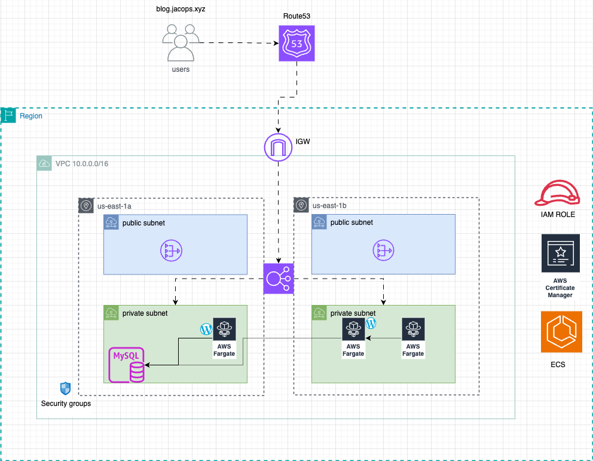
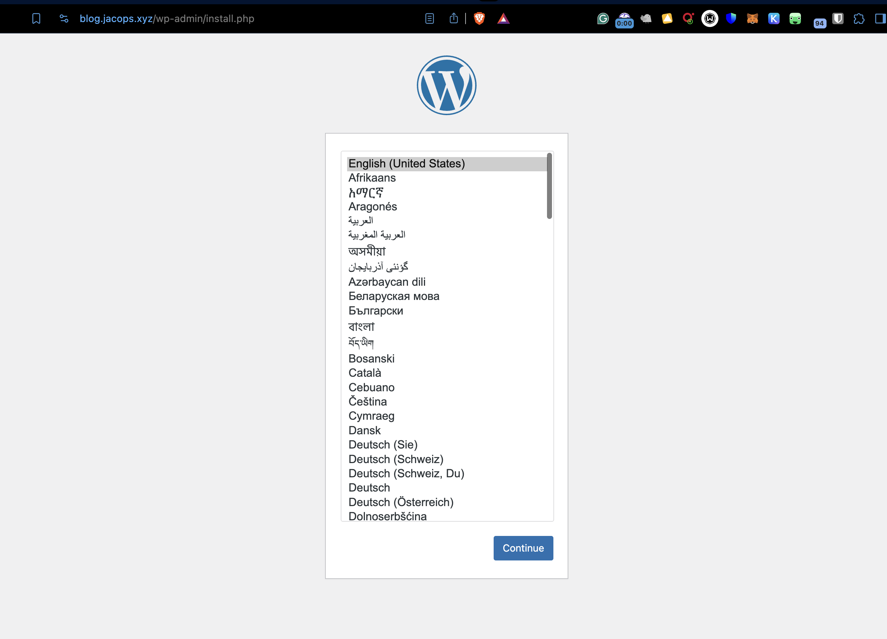

# Wordpress Deployment on Amazon ECS using Terraform

This project deploys a wordpress application and database (RDS) on an Amazon ECS cluster using Terraform. It sets up the necessary infrastructure to run containerized applications on AWS, with separate configurations for VPC and application resources.

### Infrastructure Diagram

 


# AWS ECS Deployment using Terraform


## Prerequisites

- [Terraform](https://www.terraform.io/downloads.html) (version X.X or later)
- [AWS CLI](https://aws.amazon.com/cli/) configured with appropriate credentials
- [Docker](https://www.docker.com/get-started) (for building and pushing container images)

## Project Structure

```
.
├── README.md
├── vpc/
│   ├── vpc.tf
│   ├── variables.tf
│   ├── outputs.tf
│   ├── provider.tf
│   └── main.tfvars
├── app/
│   ├── alb.tf
│   ├── app.tf
│   ├── cw_logs.tf
│   ├── data.tf
│   ├── iam.tf
│   ├── locals.tf
│   ├── outputs.tf
│   ├── provider.tf
│   ├── rds.tf
│   ├── route53.tf
│   ├── sg.tf
│   ├── variables.tf
│   └── main.tfvars
│   └── templates/
│       └── test-cloudinit.tpl
├── global/
└── imgs/
```

## Quick Start

### 1. VPC Deployment

First, we need to deploy the VPC:

1. Navigate to the VPC directory:
   ```
   cd vpc
   ```

2. Initialize Terraform:
   ```
   terraform init
   ```

3. Review and modify `main.tfvars` with your desired VPC configuration.

4. Plan the VPC deployment:
   ```
   terraform plan -var-file=main.tfvars
   ```

5. Apply the VPC changes:
   ```
   terraform apply -var-file=main.tfvars
   ```

### 2. Application Deployment

After the VPC is set up, we can deploy the application:

1. Navigate to the app directory:
   ```
   cd ../app
   ```

2. Initialize Terraform:
   ```
   terraform init
   ```

3. Review and modify `main.tfvars` with your desired application configuration.

4. Plan the application deployment:
   ```
   terraform plan -var-file=main.tfvars
   ```

5. Apply the application changes:
   ```
   terraform apply -var-file=main.tfvars
   ```

## Managing State Files

This project uses separate state files for the VPC and application configurations. State file stored in s3.

- VPC state is stored in `wp_ecs/vpc/terraform.tfstate`
- Application state is stored in `wp_ecs/app/terraform.tfstate`


## Configuration

The main configuration variables are stored in `main.tfvars` files in both the `vpc/` and `app/` directories. Modify these in line with the `sample.tfvars` to customize your deployment.

### VPC Configuration (`vpc/main.tfvars`)

```prefix = "your_prefix"
name = "wp_ecs"

cidr_block = "10.0.0.0/16"

azs             = ["us-east-1a", "us-east-1b"]
private_subnets = ["10.0.1.0/24", "10.0.2.0/24"]
public_subnets  = ["10.0.8.0/24", "10.0.3.0/24"]
```

### Application Configuration (`app/main.tfvars`)
The configuration for the app can be found in the `sample.tfvars` file.


## Outputs

After successful deployments, Terraform will output:

### VPC Outputs
- `vpc_id`: The ID of the created VPC
- `public_subnet_ids`: List of public subnet IDs
- `private_subnet_ids`: List of private subnet IDs

### Application Outputs
- `alb_dns_name`: The DNS name of the Application Load Balancer
- `ecs_cluster_name`: The name of the ECS cluster
- `alb_arn`: ARN for the ECS cluster

### Result
After a successful deployment you can access your application from your domain name, you have a fully functional wordpress application with RDS for your db.




## License
 Use as you like 🤷🏽‍♂️.